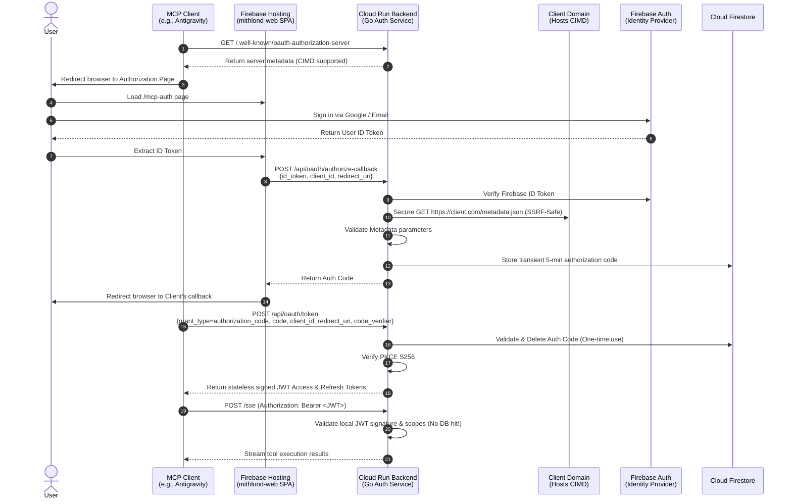
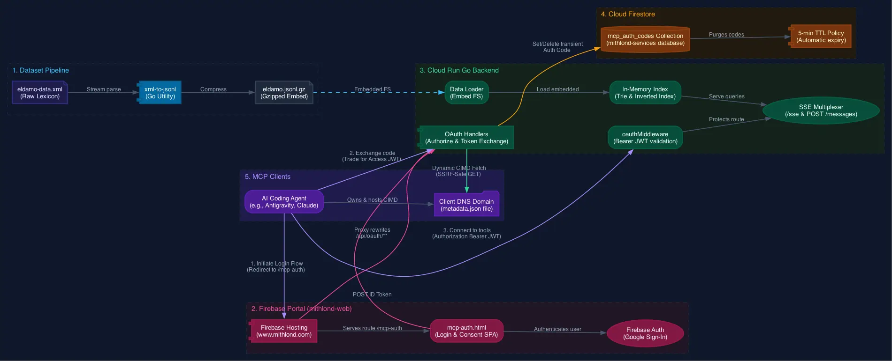

# 🌟 Eldamo Agent Tools 🌟

An high-performance **Model Context Protocol (MCP) Server** written in Go, providing AI agents with immediate, structured, linguistic access to Paul Strack's [Eldamo](http://eldamo.org/) Tolkien language lexicon compilation.

It features a secure, modern (2026-standard) **OAuth 2.1 Authentication Layer** utilizing **Client ID Metadata Documents (CIMD)**, **Firebase Auth**, and **GCP Cloud Run**.

---

## 📖 Table of Contents
1. [Exposed MCP Tools](#-exposed-mcp-tools)
2. [Developer Agent Skills](#-developer-agent-skills)
3. [Local Development & Testing](#-local-development--testing)
4. [opencode MCP Configuration](#-opencode-mcp-configuration)
5. [OAuth 2.1 & CIMD Security Flow](#-oauth-21--cimd-security-flow)
6. [System Architecture](#-system-architecture)
7. [Environment Variables & Configuration](#-environment-variables--configuration)
8. [Cloud Run Deployment](#-cloud-run-deployment)
9. [Guide: How to Build Your Own Go MCP Server](docs/how-to-create-mcp-server-go.md)

---

## 🛠️ Exposed MCP Tools

The server registers four specialized tools conforming to the Model Context Protocol specification:

### 1. `enquire_lexicon`
Performs general-purpose Tolkien linguistic search.
* **Arguments:**
  * `query` (string, required): Spelling prefix or search keyword (e.g. `"elen"`, `"flower"`, `"star"`).
  * `language` (string, optional): ISO/Eldamo language code filter (e.g. `"q"` for Quenya, `"s"` for Sindarin, `"pc"` for Primitive Elvish).
  * `speech` (string, optional): Part-of-speech filter (e.g. `"noun"`, `"verb"`, `"adjective"`, `"proper-name"`).
  * `category` (string, optional): Filter by lexicon category/era (e.g. `"neo"` for neologisms, `"primary"` for Tolkien's writings, `"root"` for roots).

### 2. `get_word_details`
Fetches complete linguistic metadata, historical notes, inflections, and semantic details for an individual entry.
* **Arguments:**
  * `id` (string, required): The unique Eldamo `page-id` (e.g., `"218765"`).

### 3. `get_derivations`
Explores the genealogical relationship and linguistic evolution of words in Tolkien's tongues.
* **Arguments:**
  * `id` (string, required): The unique Eldamo `page-id` (e.g., `"218765"`).
  * `direction` (string, optional): Either `"descendants"` (words produced by this word, default) or `"ancestors"` (the roots this word was derived from).

### 4. `get_root_anchors`
Retrieves proper names (characters, places, stars, weapons, etc.) recursively derived from a specific root or base word ID.
* **Arguments:**
  * `id` (string, required): The unique Eldamo `page-id` of the root or base word (e.g., `"2071154627"`).


## 🧠 Developer Agent Skills

This repository bundles specialized agent skills within the `skills/` directory, assisting developer agents to approach complex, artistic, and precise Elvish linguistic tasks:

### 1. `neologism-builder`
* **TL;DR:** Guides the creation of Neo-Elvish vocabulary. Offers a choice between **Practical (Functional)** compounding and **Poetic (Metaphorical)** concepts, evaluated via a **100-point Quantitative Scoring Matrix** that balances strict phonetic constraints against acoustic iconicity and proper-noun lineage, derived in part from The Digital Tolkien Project's [arda](https://github.com/digitaltolkien/arda) pronunciation library.

### 2. `tolkien-name-generator`
* **TL;DR:** Autonomously generates grammatically and historically-based Tolkien Elvish names for people, places, stars, or weapons. Compounds linguistic roots using proper Sandhi consonant merges and applies attested suffix paradigms.

### 3. `tolkien-translation`
* **TL;DR:** Translates English phrases into Tolkien's main languages (Quenya, Sindarin, and Adûnaic). Analyzes sentence grammar, verb conjugations, adjective agreements, and case morphology, ensuring appropriate historical dialect selection.

---

## 💻 Local Development & Testing

### 1. One-Line Installation (Prebuilt)
For users who do not wish to clone the repository, install the latest binary automatically:
```bash
curl -sL https://raw.githubusercontent.com/ghchinoy/eldamoapi/main/scripts/install.sh | bash
```

### 2. Build and Run Local Server
If you prefer to build from source, compile and run the server locally on port `8080` (utilizing your local `.env` configuration):
```bash
make run
```

### 3. Quick Start (No Auth)
For rapid local testing without authentication setup, run the development build:
```bash
make run-dev
```
*(See `docs/DEVELOPMENT.md` for details on how this bypasses authentication.)*

### 4. Run Test Suite
Our comprehensive test suite validates database models, prefix/keyword indexers, SSRF dialer blocking, CIMD parser mocks, and cryptographic JWT verifications:
```bash
make test
```

### 5. Static Code Analysis (Linter)
Validate code quality using golangci-lint:
```bash
golangci-lint run
```

---

## ⚡ Client Configurations

To add your remote, secure Eldamo MCP server to your desktop agent, follow the configurations below based on your client of choice.

### 1. opencode
Configure the server in your local or global `opencode.json` file:

#### Project-Specific Config (Local)
Create an **`opencode.json`** file in the root of your local workspace directory:

```json
{
  "$schema": "https://opencode.ai/config.json",
  "mcp": {
    "eldamo-remote": {
      "type": "remote",
      "url": "https://eldamo-mcp-server-308690897031.us-central1.run.app/sse",
      "enabled": true,
      "oauth": {
        "clientId": "https://www.mithlond.com/metadata.json",
        "authorizationUrl": "https://www.mithlond.com/mcp-auth",
        "tokenUrl": "https://eldamo-mcp-server-308690897031.us-central1.run.app/api/oauth/token"
      }
    }
  }
}
```

#### Global Config (Universal)
Add the server block to your global configuration file at **`~/.config/opencode/opencode.json`**:

```json
{
  "$schema": "https://opencode.ai/config.json",
  "mcp": {
    "eldamo-remote": {
      "type": "remote",
      "url": "https://eldamo-mcp-server-308690897031.us-central1.run.app/sse",
      "enabled": true,
      "oauth": {
        "clientId": "https://www.mithlond.com/metadata.json",
        "authorizationUrl": "https://www.mithlond.com/mcp-auth",
        "tokenUrl": "https://eldamo-mcp-server-308690897031.us-central1.run.app/api/oauth/token"
      }
    }
  }
}
```

> [!IMPORTANT]
> Always quit and **restart opencode** after saving configuration changes for the remote MCP server to take effect.

---

### 2. Google Antigravity
Configure the server in your global configuration file at **`~/.gemini/config/mcp_config.json`**:

```json
{
  "mcpServers": {
    "eldamo-remote": {
      "serverUrl": "https://eldamo-mcp-server-308690897031.us-central1.run.app/sse",
      "headers": {
        "X-Mcp-Force-Sse": "true"
      },
      "oauth": {
        "clientId": "https://www.mithlond.com/metadata.json",
        "authorizationUrl": "https://www.mithlond.com/mcp-auth",
        "tokenUrl": "https://eldamo-mcp-server-308690897031.us-central1.run.app/api/oauth/token"
      }
    }
  }
}
```

---

## 🔒 OAuth 2.1 & CIMD Security Flow

This server implements a secure, zero-database-registration authorization pipeline based on the IETF draft **Client ID Metadata Documents (CIMD)**:



### Architectural Benefits:
1. **Zero Registration Spam:** We do not expose a public registration endpoint. Clients host their own metadata JSON file (`client_id` URL). Trust is anchored on DNS ownership and HTTPS transport.
2. **SSRF-Blocking Security:** The Go backend dialer resolves hostnames and blocks all private, local-link, loopback, and unspecified IPs in production to completely defeat Server-Side Request Forgery.
3. **Stateless Scale-to-Zero Active Calls:** Access tokens are signed JWTs (`HS256`). During active MCP tool execution, signature validation is entirely local and CPU-bound—**never querying Firestore during active tool calls**, keeping response times in sub-milliseconds and GCP resource costs at zero!

---

## 🏗️ System Architecture

The Eldamo MCP Server is designed for speed, memory efficiency, and serverless scalability. It features a self-contained, zero-external-dependency, in-memory search engine.



### Key Architectural Pillars:
* **Gzip Embed In-Memory Engine (`data/`):** Local preprocessed JSON Lines dataset compressed to **`eldamo.jsonl.gz` (~4.5MB**, down from `24.8MB` raw) and embedded directly into the compiled Go binary using `go:embed`. On server startup, decompression executes under 20ms, allowing scale-from-zero on Google Cloud Run.
* **Double-Index Search Engine (`index/`):**
  * **Prefix Trie (Prefix Tree):** Maps all Tolkien vocabulary for fast, autocomplete-friendly word-spelling queries.
  * **Inverted Keyword Index:** Tokenizes and normalizes glosses, definitions, neologisms, and historical linguistic notes, supporting complex matching.
* **Ultra-Low Memory Footprint:** The entire compiled binary plus the complete decompressed index and tries consume only `~40-50MB` of RAM, enabling stable hosting on Cloud Run’s most economical resource tier.

---

## ⚙️ Environment Variables & Configuration

Local configurations are managed in a **`.env`** file at the project root. This file is excluded from Git to protect sensitive credentials.

The backend uses the following environment variables, evaluated with fallback/precedence logic:

| Variable Name | Purpose | fallback / Precedence Logic |
| :--- | :--- | :--- |
| `GCP_PROJECT` | Google Cloud project ID. | Sourced from `.env`; defaults to `testingproject-19c4c` during build. |
| `GCP_REGION` | Cloud Run container region. | Sourced from `.env`; defaults to `us-central1`. |
| `SERVICE_NAME`| Cloud Run deployment name. | Sourced from `.env`; defaults to `eldamo-mcp-server`. |
| `FIREBASE_PROJECT_ID` | Project ID for Firebase Admin verification. | Matches `GCP_PROJECT`. Defaults to `testingproject-19c4c`. |
| `FIREBASE_DATABASE` | Targets specific Firestore DB instance. | Sourced from `.env`; defaults to **`mithlond-services`** (NOT `(default)`). |
| `JWT_SIGNING_KEY` | Cryptographic key to sign/verify stateless tokens. | Sourced from `.env`; **dynamically generated as a random 32-char hex string** on first deploy if missing. |
| `ELDAMO_API_KEYS` | (Optional) Comma-separated API keys. | Set to restrict access without full OAuth. If empty, OAuth 2.1 is used exclusively. |

---

## 🚀 Cloud Run Deployment

Deployment is fully automated using our secure shell pipeline. This pipeline loads your local `.env` variables, ensures GCP resources are fully initialized, and compiles the service in-cloud.

```bash
# Execute deployment pipeline
./scripts/deploy.sh
```

### Deployment Blueprint & Security Hardening:
* **IAM Least-Privilege Role Binding:** The script automatically checks for a dedicated, isolated service account `eldamo-mcp-runner`. It binds only the **`roles/datastore.user`** permission to allow reading and purging transient Firestore codes, leaving other cloud segments fully protected.
* **Auto-Purging TTL Policy:** The database TTL is automatically configured via `gcloud` to purge expired codes from the `mcp_auth_codes` collection after 5 minutes, preventing manual maintenance tasks.
* **Docker Containerization:** Google Cloud Build runs a multi-stage compilation in-cloud, compiling an optimized, statically linked Go binary running inside a minimal Scratch container.
