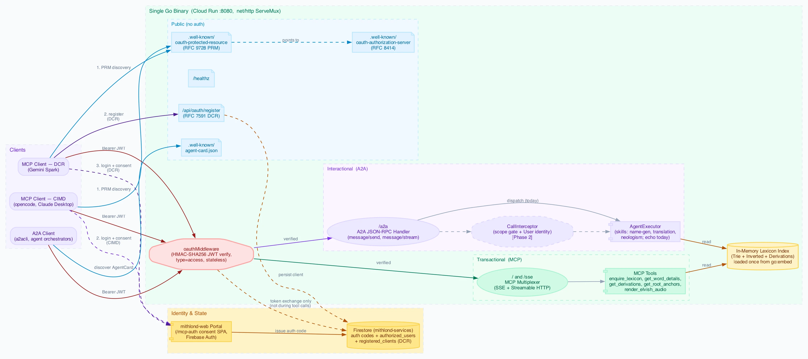

# Dual-Protocol Architecture: MCP (Transactional) + A2A (Interactional)

This document describes how the Eldamo server exposes **two complementary agent
protocols from a single Go binary**, sharing one OAuth 2.1 security layer and one
in-memory lexicon index:

| Protocol | Nature | Surface | Who calls it |
| :--- | :--- | :--- | :--- |
| **MCP** (Model Context Protocol) | **Transactional** — stateless request/response tool calls | `/sse` (SSE + Streamable HTTP multiplexer) | An LLM that wants raw lexicon *tools* (search, lookups, derivations, TTS) |
| **A2A** (Agent2Agent) | **Interactional** — agentic *skills*, optionally streaming/long-running | `/a2a` (JSON-RPC) | Another agent that wants the Eldamo agent to *do a task* (generate a name, translate a phrase) |

The mental model: **MCP exposes tools; A2A exposes an agent that uses those
tools.** Both read the same lexicon; both are gated by the same JWT verifier.



> Source: [`dual-protocol-architecture.dot`](dual-protocol-architecture.dot) ·
> regenerate with the [diagram workflow](#regenerating-diagrams).
> For the OAuth 2.1 / CIMD / Firestore flow in depth, see
> [`architecture.md`](architecture.md).

---

## 1. Design principles

1. **One binary, one mux, one OAuth layer.** Both protocol handlers are mounted
   on the same `http.ServeMux` in `main.go`, each wrapped by the *same*
   `oauthMiddleware`. There is no second service to deploy, no duplicated auth,
   and the ~4.5 MB embedded lexicon is decompressed and indexed **once**.
2. **Shared core, thin protocol adapters.** The business logic lives in the
   `index` package (`index.Index`). MCP tool handlers and the A2A
   `AgentExecutor` are both thin adapters over the same `lexiconIndex` global.
3. **Pure `net/http`.** Both the MCP Go SDK and `a2a-go` return plain
   `http.Handler`s, so they compose with the existing middleware chain without a
   web framework.
4. **Public discovery, protected protocol.** Discovery documents
   (`/.well-known/*`) are unauthenticated; the protocol endpoints they advertise
   require a Bearer JWT.
5. **Deterministic-first skills.** A2A skills start as pure-Go logic over the
   lexicon (no LLM dependency). LLM-backed skills (e.g. free translation) are an
   opt-in fast-follow, not a baseline requirement.

---

## 2. Component map

| Concern | File / symbol |
| :--- | :--- |
| Server bootstrap, mux, routes | `main.go` → `main()` |
| MCP server + tool registration | `main.go:399` (`mcp.NewServer`, `mcp.AddTool`) |
| MCP transport multiplexer | `main.go` → `McpMultiplexerHandler` (SSE + Streamable HTTP) |
| A2A echo executor (Phase 1) | `a2a.go` → `echoAgentExecutor` |
| A2A AgentCard builder | `a2a.go` → `buildAgentCard`, `handleAgentCard` |
| A2A JSON-RPC handler | `a2a.go` → `newA2AHandler` (`a2asrv.NewJSONRPCHandler`) |
| Shared security gate | `oauth.go` → `oauthMiddleware` |
| OAuth token exchange / callback / CIMD | `oauth.go` → `handleTokenExchange`, `handleAuthCallback`, `FetchAndValidateCIMD` |
| Lexicon index (shared core) | `index/index.go` → `index.Index` |
| Admin / token CLI | `cmd/eldamo-admin` |

### Routes

| Path | Auth | Purpose |
| :--- | :--- | :--- |
| `GET /healthz` | none | Liveness probe |
| `GET /.well-known/oauth-authorization-server` | none | OAuth 2.1 server metadata |
| `GET /.well-known/agent-card.json` | none | A2A AgentCard discovery |
| `POST /api/oauth/authorize-callback` | Firebase ID token | Consent-SPA callback → issues auth code |
| `POST /api/oauth/token` | PKCE / refresh | Token exchange |
| `* /sse` | Bearer JWT | **MCP** (transactional) |
| `* /a2a`, `/a2a/` | Bearer JWT | **A2A** (interactional) |

---

## 3. Security model

A2A reuses the MCP security stack rather than introducing a parallel one.

### 3.1 Shared verifier

`oauthMiddleware` (`oauth.go`) wraps **both** `/sse` and `/a2a`. It:

- accepts `AUTH_BYPASS=true` for local dev;
- extracts the token from `Authorization: Bearer …` (A2A clients map
  `ServiceParams["authorization"]` → this header) with a `?token=` query
  fallback for SSE;
- validates the HMAC-SHA256 signature locally (no DB lookup) and requires
  `type == "access"`.

This means a single JWT issued by the OAuth flow — or by
`eldamo-admin token <uid>` / `make token` — works for **both** protocols.

### 3.2 AgentCard advertises the requirement

The A2A AgentCard (`buildAgentCard`) is the discovery contract. Today it
declares the JSON-RPC interface and skills. **Phase 4** adds an
`OAuth2SecurityScheme` (authorizationCode + PKCE) pointing at the existing
`https://www.mithlond.com/mcp-auth` authorize endpoint and `/api/oauth/token`,
so spec-compliant A2A clients can discover and satisfy the auth requirement.

### 3.3 Per-skill scope gating (Phase 2)

The existing `gate()` / `authorizeScopes` helpers and the scope vocabulary
(`lexicon:read`, `audio:generate`) extend naturally to A2A. The plan:

1. `oauthMiddleware` stashes the validated `jwt.MapClaims` into the request
   `context` (benefits MCP `gate()` too).
2. The A2A transport already threads the request context into
   `ExecutorContext`, and an `a2asrv.CallInterceptor` (registered via
   `WithCallInterceptors`) reads those claims to populate `a2asrv.User` and
   reject calls lacking the required scope (e.g. `skill:name-generate`).

### 3.4 Client auth ergonomics

- **MCP clients** (opencode, Claude Desktop) run the full interactive OAuth /
  CIMD flow via the consent SPA.
- **A2A clients** like [`a2acli`](https://github.com/ghchinoy/a2acli) are
  passthrough-auth: obtain a JWT out-of-band and pass `--token`. The dev loop is
  `source .env && a2acli --token "$(make token)" send …`.
  Always `source .env` first — `make token` reads `JWT_SIGNING_KEY` from the
  environment and falls back to the hardcoded dev key if unset, which won't
  match a Cloud Run server running with a real secret.

---

## 4. The interactional layer (A2A) in detail

### 4.1 AgentExecutor

The single interface an implementer satisfies is `a2asrv.AgentExecutor`
(`Execute` / `Cancel`), using Go 1.23+ iterators (`iter.Seq2[a2a.Event, error]`)
to *yield* events. The SDK consumes them, persists task state, and streams to the
client. Phase 1 ships `echoAgentExecutor`, which echoes the inbound message text.

### 4.2 Skills

A2A `AgentSkill`s are **declarative metadata** advertised in the AgentCard; the
SDK does not dispatch by skill — routing is the executor's job. The three
existing repo skills map directly onto A2A skills:

| Repo skill (`skills/`) | A2A skill (planned) | Execution model |
| :--- | :--- | :--- |
| `tolkien-name-generator` | `name-generate` | Deterministic Go over the lexicon |
| `neologism-builder` | `neologism-build` | Deterministic (scoring matrix) |
| `tolkien-translation` | `translate` | LLM-backed (fast-follow) |

### 4.3 Transport choice: JSON-RPC

`/a2a` uses `a2asrv.NewJSONRPCHandler` — a single POST endpoint that namespaces
cleanly under a path prefix and uses SSE for streaming methods (the existing
`sseLoggingMiddleware` already sets `X-Accel-Buffering: no` to defeat Cloud
Run/GFE buffering). REST was avoided because its internal `/v1/...` routes want a
root mount; gRPC was avoided because it needs a separate listener and cannot
serve the well-known card.

### 4.4 Task store

The default in-memory task store is fine for a single instance. Because Cloud Run
autoscales, resumable/long-running tasks need a shared store; a **Firestore-backed
`taskstore`** (reusing the existing `mithlond-services` database) is the
production path (Phase 5).

---

## 5. Phased roadmap

Tracked as `bd` issues under the **A2A exposure** epic (`bd list`).

| Phase | Goal | Status |
| :--- | :--- | :--- |
| **1. Wiring spike** | Mount A2A JSON-RPC + AgentCard behind `oauthMiddleware`; echo executor; verify with `a2acli` | ✅ Done |
| **2. Claims + scope gating** | Stash claims in context; `CallInterceptor` for `User`/scopes; wire MCP `gate()` | Planned |
| **3. First real skill** | `name-generate` (deterministic) over the lexicon, streaming progress | Planned |
| **4. AgentCard security + scopes** | `OAuth2SecurityScheme` in card; new scopes in `eldamo-admin` | Planned |
| **5. Production hardening** | Firestore `taskstore`, conformance tests, deploy/env, docs | Planned |

---

## 6. Regenerating diagrams

Diagrams are authored in Graphviz DOT and rendered to WebP:

```bash
cd docs
dot -Tpng -Gdpi=144 dual-protocol-architecture.dot -o /tmp/dpa.png
cwebp -q 90 /tmp/dpa.png -o dual-protocol-architecture.webp
```

Requires `graphviz` (`dot`) and `cwebp` (from `webp`), both installable via
Homebrew: `brew install graphviz webp`.
